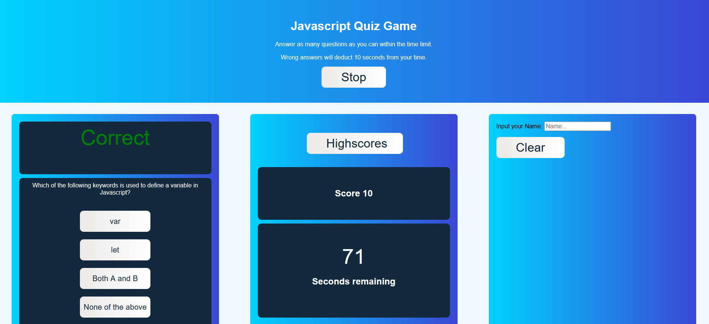

# Assignment-04-Web-APIs-Code-Quiz
Coding Quizz for practice 

The purpose of this code is to display a series of questions for the user to answer and keep track of their score within a timed environment. 

screenshot  
link to deployed application (https://na-ag.github.io/04-Web-APIs-Code-Quiz/)

